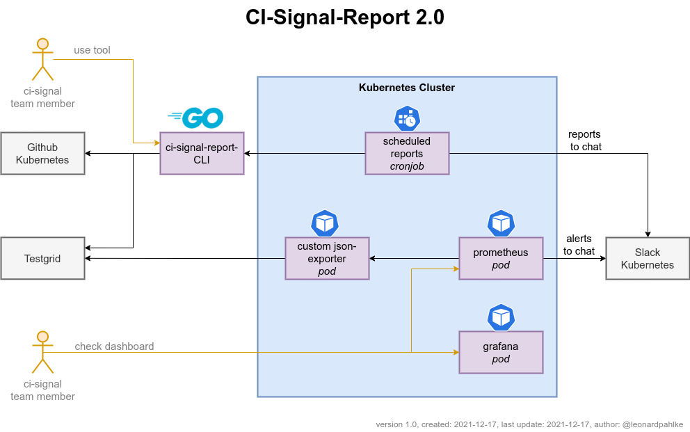
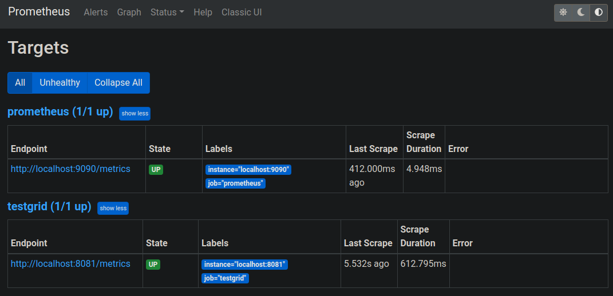
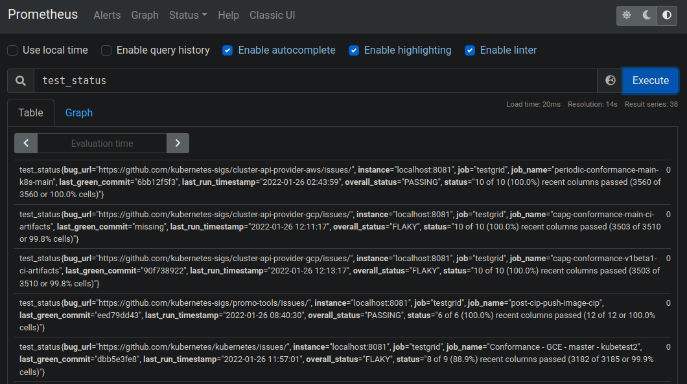

# K8s-Testgrid JSON Exporter

This project is a work in progress and not ready for production usage.

In short the project should show on a one page dashboard the current state of [testgrid](https://testgrid.k8s.io/) that is relevant to cut the release ([master-blocking](https://testgrid.k8s.io/sig-release-master-blocking), [master-informing](https://testgrid.k8s.io/sig-release-master-informing), 1.XX-blocking, 1.XX-informing). In addition to monitoring testgrid from a higher-level perspective, this platform should also be used to send scheduled reports, alerts, and perhaps more in the future.

The diagram below shows the architecture of the project. 


### Usage

As shown in the architecture diagram, the application is build with containers. The application can be run using `podman` / `docker` or 'manually' with the helm charts out of the box on a `kubernetes` cluster. 

#### Run it with Podman / Docker locally

To test the application you can use a container which gets setup using the `Containerfile`.
To use the container image use `docker` or `podman`.

1. Build testgrid container `testgrid-exporter`
2. Check build container images
3. Run testgrid container
4. Pull prometheus container ([prom/prometheus](https://hub.docker.com/r/prom/prometheus))
5. Run prometheus container with custom config
6. Check if prometheus uses the custom `testgrid-exporter`

```bash
# 1. Build the container image
$ podman build -t testgrid-exporter .

# 2. Check the created container images
$ podman images
REPOSITORY                   TAG         IMAGE ID      CREATED         SIZE
localhost/testgrid-exporter  latest      07ea6fda0170  11 minutes ago  137 MB
docker.io/library/python     3.9.7-slim  ccd065bd50c5  3 months ago    127 MB

# 3. Run the container image and open a bash shell to interact with the running container
$ podman run -dt -p 127.0.0.1:8081:8081/tcp $(podman images testgrid-exporter --quiet)

# Now the testgrid json exporter runs and acts as sink for prometheus

# 4. Pull prometheus container image
$ podman pull docker.io/prom/prometheus:latest
Trying to pull docker.io/prom/prometheus:latest...
...
a3d385fc28f956eXXXXXXXXXXXXXXXXXXXXXXXXXXXXXXXXcd1802f2dc1dc9b4b

# 5. Start prometheus container with custom config
$ podman run -dt -p 9090:9090/tcp --network=host --mount type=bind,src=test/docker/prometheus.yml,target=/etc/prometheus/prometheus.yml $(podman images prom/prometheus --quiet)
a3d385fc28f956eXXXXXXXXXXXXXXXXXXXXXXXXXXXXXXXXcd1802f2dc1dc9b4b

# 6. Now prometheus is up and running and automatically fetches the custom testgrid-exporter
```

Check prometheus on localhost:9090

Check if targets are up


Run a query


Done!

#### Run it with Kubernetes
This project provides a helm chart to ease the K8s deployment. 

The container images needs to be pushed to a container registry.
Images are publicly pushed to [quay.io/leonardpahlke/testgrid-exporter](https://quay.io/repository/leonardpahlke/testgrid-exporter?tag=latest&tab=tags) as an interim solution.
The helm chart refers use the container image from quay.io in `deploy/values.yaml`.

To use your own container registry, push the container image `testgrid-exporter`.

```bash
# Login to the container registry
$ podman login quay.io --verbose

# Build the container image if not done so already
$ podman build -t testgrid-exporter .

# Run the contaimer image if not done so already
$ podman run -dt -p 127.0.0.1:8081:8081/tcp $(podman images testgrid-exporter --quiet)

# Tag the container image to the known image name
$ podman commit $(podman ps -lq) quay.io/<username>/testgrid-exporter:<version>
Getting image source signatures
...
Storing signatures
5df2dc1dc9XXXXXXXXXXXXXXXXXXXde2918a59af2dc1dc9a28

# Push the container image
$ podman push quay.io/<username>/testgrid-exporter:<version>
Getting image source signatures
...
Storing signatures

# update `deploy/values.yaml`
# the other container images in use are publicly available
```

To deploy the application to kubernetes use the helm charts as mentioned before.

``` bash
$ cd deploy/testgrid-exporter
$ kubectl create ns monitoring
$ helm template monitoring -n monitoring . -f values.yaml > exporter.yaml
$ kubectl -n monitoring create -f exporter.yaml

$ kubectl -n monitoring get po 
NAME                                                     READY   STATUS    RESTARTS        AGE
$ testgrid-exporter-99fc457cd-qpqd5                        1/1     Running   0               1m

$ kubectl -n monitoring port-forward svc/testgrid-exporter 8081:8081
```

You should be able to access the exposed metrics http://127.0.0.1:8081

## Roadmap

- [X] Configure custom testgrid json exporter container
- [X] Configure prometheus to use testgrid json exporter
- [X] Create helm charts
- [x] Donate repository to k-sigs org: https://github.com/kubernetes/org/issues/3218
- [ ] Grafana dashboard + configuration: https://github.com/kubernetes-sigs/testgrid-json-exporter/issues/2
- [ ] Publish container images to a community container registry: https://github.com/kubernetes-sigs/testgrid-json-exporter/issues/1
- [ ] Multistage build for the image `testgrid-exporter`: https://github.com/kubernetes-sigs/testgrid-json-exporter/issues/5
- [ ] Kubernetes Slack Notifications & Alerts: https://github.com/kubernetes-sigs/testgrid-json-exporter/issues/4
- [ ] Host project on community owned infrastructure: https://github.com/kubernetes-sigs/testgrid-json-exporter/issues/3

## Community, discussion, contribution, and support
You can reach the maintainers of this project at:

* [Kubernetes Slack](https://slack.k8s.io/) at `#sig-release` and `#release-ci-signal`

## Sponsoring SIG's
* [`sig-release`](https://github.com/kubernetes/sig-release)

## Code of conduct
Participation in the Kubernetes community is governed by the Kubernetes [Code of Conduct](code-of-conduct.md).
